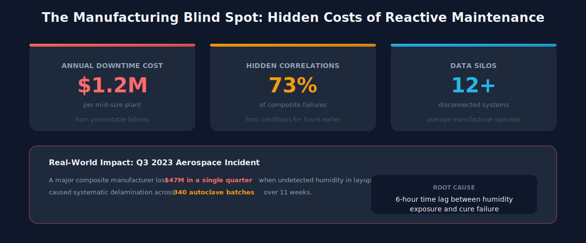
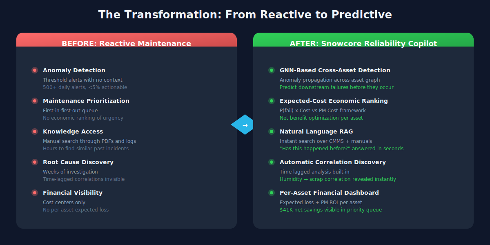
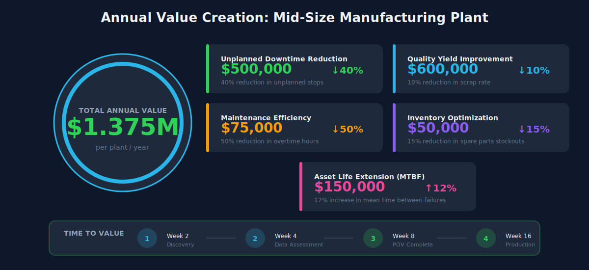
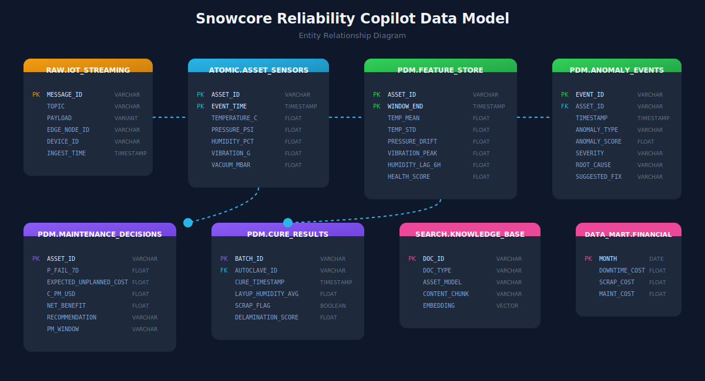

# Snowcore Reliability Copilot
## Predictive Maintenance Intelligence for High-Performance Manufacturing

---

## 1. The Cost of Inaction

**In 2023, a major aerospace composite manufacturer lost $47M in a single quarter** when undetected humidity levels in their layup room caused systematic delamination failures across 340 autoclave batches. The root cause—a 6-hour time lag between humidity exposure and cure failure—remained invisible for 11 weeks.

### The Manufacturing Blind Spot

| Challenge | Industry Reality |
|-----------|------------------|
| **Hidden Correlations** | 73% of composite failures originate from environmental conditions 6+ hours earlier |
| **Data Silos** | Average manufacturer operates 12+ disconnected OT/IT systems |
| **Tribal Knowledge Loss** | 40% of maintenance expertise exits with retiring workforce annually |
| **Reactive Maintenance** | Unplanned downtime costs 3-10x more than planned maintenance |

**The average high-performance manufacturer loses $1.2M monthly to preventable failures** that existing sensor systems fail to predict because they lack cross-process context.

---

## 2. The Problem in Context

### What Manufacturing Leaders Face Today

| Pain Point | Business Impact | Who Feels It |
|------------|-----------------|--------------|
| **Invisible Process Correlations** | High-humidity layup → 3x scrap rates 6 hours later during cure | Plant Manager |
| **Alert Fatigue Without Context** | 500+ daily sensor alerts, <5% actionable | Line Operator |
| **Lost Institutional Knowledge** | Cannot search 5 years of CMMS logs to match "has this happened before?" | Maintenance Lead |
| **Siloed OT + IT Data** | Sensor data disconnected from ERP, maintenance history, manuals | All Personas |
| **Reactive Decision Making** | Expected-value PM decisions impossible without probability models | Finance/Operations |

### The Real Cost

**$135,460 in expected loss** sits on a single plant's maintenance queue right now—visible only if you can model failure probability × consequence cost. Without this math, urgent interventions are indistinguishable from routine checks.

---

## 3. The Transformation

| Dimension | Before | After |
|-----------|--------|-------|
| **Anomaly Detection** | Threshold alerts (no context) | GNN-based cross-asset propagation |
| **Maintenance Prioritization** | First-in-first-out | Expected-cost economic ranking |
| **Knowledge Access** | Manual search through PDFs/logs | Natural language RAG over CMMS + manuals |
| **Root Cause Discovery** | Weeks of investigation | Instant time-lagged correlation (humidity → scrap) |
| **Financial Visibility** | Cost centers only | Per-asset expected loss + PM ROI |

### The Hidden Discovery Moment

When investigating "Why is scrap high this week?", the system reveals that **Layup Room humidity readings above 65%**—which appeared normal and triggered no alarms—caused **3x higher scrap rates** during autoclave cure cycles 6 hours later. This $50K+ per batch correlation was invisible without cross-process time-lagged analysis.

---

## 4. What We'll Achieve

### Quantified Business Outcomes

| Metric | Target Improvement | Annual Value (Mid-Size Plant) |
|--------|-------------------|-------------------------------|
| **Unplanned Downtime** | ↓ 40% | $500,000 |
| **First Pass Yield (Scrap)** | ↓ 10% | $600,000 |
| **Maintenance Overtime** | ↓ 50% | $75,000 |
| **Spare Parts Inventory** | ↓ 15% | $50,000 |
| **Asset Life Extension (MTBF)** | ↑ 12% | $150,000 |
| **Total Annual Value** | | **$1.375M** |

### The "Wow" Moment

An anomaly triggers on `Autoclave_02`. The operator asks the Reliability Copilot: *"Has this happened before?"*

The Agent searches 5 years of unstructured CMMS logs, finds a similar incident from 2022, summarizes the resolution ("Replaced Vacuum Seal B"), and pulls the exact replacement procedure from the PDF Maintenance Manual—side-by-side, in seconds.

---

## 5. Why Snowflake

### The Four Pillars

| Pillar | Snowcore Implementation |
|--------|-------------------------|
| **Unified Data** | OT sensor streams, ERP schedules, CMMS logs, and PDF manuals converge on one platform—no ETL pipelines to maintain |
| **Native AI/ML** | Cortex Analyst (text-to-SQL), Cortex Search (RAG), and Snowpark ML (GNN anomaly propagation) run where the data lives |
| **Collaboration** | Reliability models can be shared across plants via Snowflake Data Sharing; partner manuals via Marketplace |
| **Governance** | Role-based access ensures operators see their assets; executives see financial rollups; IP stays protected |

### Competitive Differentiation

| Competitor Approach | Snowflake Advantage |
|--------------------|---------------------|
| AWS/Azure: 7+ services (IoT Hub → Kinesis → S3 → Glue → Redshift → SageMaker) | **Kappa Architecture**: Ingest once, everything runs on same data |
| C3.ai / Palantir: Black-box ontology, vendor lock-in | **Glass Box**: Python/SQL models you own |
| OSIsoft PI / Seeq: OT island, no business context | **Context Engine**: OT meets IT (sensors + ERP + CMMS) |

**CFO Hook**: *"Competitors charge for storage, then compute to move it, then compute to train, then compute to host the API. In Snowflake, you eliminate the 'Data Movement Tax.' For a plant this size, that's $2-3M in infrastructure savings before operational improvements."*

---

## 6. How It Comes Together

### Solution Components

| Layer | Component | Snowflake Capability |
|-------|-----------|---------------------|
| **Ingestion** | Sparkplug B / UNS from PLCs, DCS, SCADA | Snowpipe Streaming (<1s latency) |
| **Storage** | Time-series sensors + CMMS text + PDF manuals | Hybrid Tables + Stages |
| **Processing** | Feature engineering, rolling windows, normalization | Dynamic Tables + Snowpark |
| **ML/AI** | GNN anomaly propagation + Autoencoder reconstruction | Snowpark ML + Model Registry |
| **Intelligence** | Text-to-SQL, RAG search, Agent orchestration | Cortex Analyst + Search + Agents |
| **Presentation** | React dashboard with live streaming | Snowflake App Framework |

### Application Views

| View | Purpose | Primary User |
|------|---------|--------------|
| **Dashboard** | Asset risk & maintenance priorities with expected-cost framework | Operations Manager |
| **Telemetry** | Real-time anomaly events, humidity-scrap correlation charts | Process Engineer |
| **Live Sensors** | Per-asset streaming sensor visualization | Line Operator |
| **Analytics** | Maintenance efficient frontier, cost comparison charts | Finance/Planning |
| **GNN Graph** | Anomaly propagation network with node-level impact | Reliability Engineer |
| **Copilot** | Natural language AI assistant with RAG over manuals/CMMS | Maintenance Lead |
| **Controls** | Simulation management and anomaly injection | Demo/Training |

### Data Model

---

## Demo Narrative Arc

**Act 1 (Speed)**: Show Snowpipe Streaming landing data in <1 second from the edge.

**Act 2 (Convergence)**: Join OT sensors to ERP maintenance schedule + CMMS history in a single query.

**Act 3 (AI)**: Run GNN anomaly propagation + RAG knowledge retrieval—all in SQL, without exporting data.

---

## Industry Extensibility

| Industry | "Autoclave" Equivalent | Primary Sensors | Strategic Value |
|----------|------------------------|-----------------|-----------------|
| **Semiconductor** | Etch/CVD Chamber | Gas Flow, RF Power, Wafer Temp | Yield Optimization |
| **Aerospace** | Large-Scale Autoclave | Heat, Vacuum, Resin Flow | Safety & Certification |
| **HVAC** | Centrifugal Chiller | Refrigerant Pressure, Vibration | Energy Efficiency |
| **Heavy Equipment** | Engine/Drivetrain | Oil Pressure, Vibration, Load | Uptime (PdM) |

**Position**: "Industrial Reasoning Engine"—not just storing or seeing data, but reasoning over it to make financial decisions.

---

## Next Steps

1. **Discovery Workshop** (2 hours): Map your asset graph and identify highest-value correlation candidates
2. **Data Assessment** (1 week): Evaluate OT connectivity and CMMS data quality
3. **Proof of Value** (4 weeks): Deploy on 2-3 critical assets with measurable KPIs
4. **Production Rollout** (8 weeks): Scale across plant with change management support

**Contact**: Schedule a demo at [snowflake.com/manufacturing](https://snowflake.com/manufacturing)
